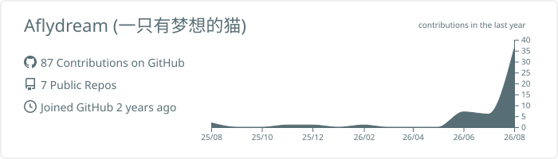
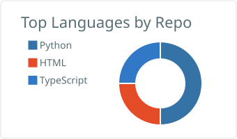
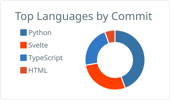

# Hi 👋, I'm Aflydream

### A curious cat who loves coding, cola & open source (of course & money)

 
   

  

- 🔭 I'm currently working on **Exploring new horizons...**

- 🌱 I'm currently learning **Studying at school... and pursuing deeper academic studies.**

- 👯 I'm looking to collaborate on **https://github.com/Marsfox-Studio/Tragents**

- 🤝 I'm looking for help with **Maybe just a coffee \o/**

- 💬 Ask me about **AI (especially about prompt), HTML, CSS, C++, Qt**

- 📫 How to reach me **aflydream@outlook.com or 3530522338@qq.com**

- ⚡ Fun fact **I'm a silly cat from cat planet**

<h3 align="left">Connect with me:</h3>

<h3 align="left">Languages and Tools:</h3>

                              

<h3 align="left">GitHub Stats:</h3>

  
    
  
  

